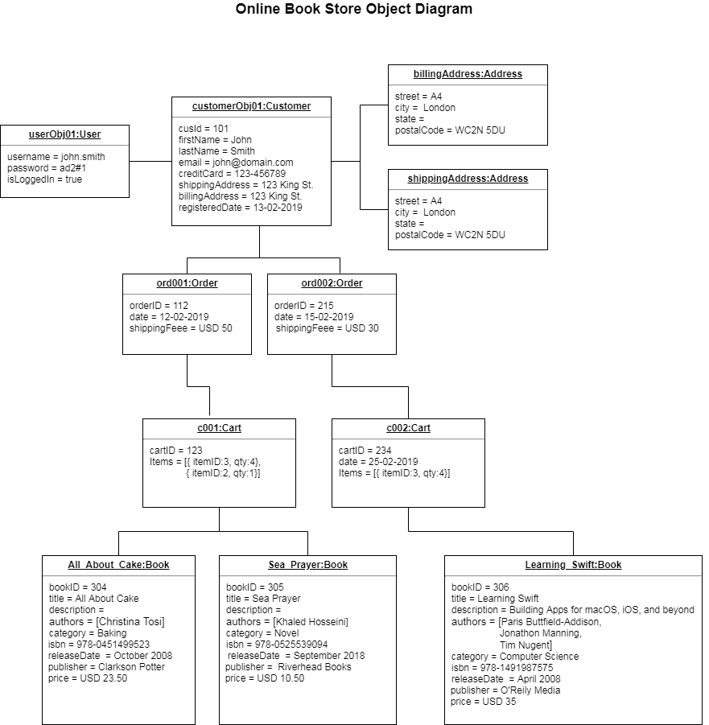

## Homework Assignment #12: Object Oriented Programming.

### What is Object Oriented Programming?

Object Oriented Programming (OOP) model real world things that we want to represent in a program. They are the centerpiece of OOP based applications. Real world objects have properties and these objects can make actions. The actions are the methods that object can do. For example, human is an object. human can be defined using properites such as name, age, DOB, height, weight, skin color etc. Human can perform certain actions. We can define human object actions such as walk, talk, breath, eat, sleep. 

### Why do we use?

Objects contain data and perform some logic based on their data. Therefore, OOP easy to understand. It helps to distinguish data and methods separately. Objects have functions that operate on the data the objects contain. Class is a blueprint in OOP which is used to instantiate objects. 

Inheritance is a powerful tool for avoiding redundancy. Inheritance lets you create a new class by extending an existing class with additional properties and functions. The new class “inherits” all of the features of its parent, avoiding the creation of new code from scratch. Furthermore, any changes made to the parent class will automatically be available to the child class. This makes updates much easier.

OOP provides encapsulation, which prevents access to data except through the object's methods.

### When to use?

A JavaScript application is written in functional, event-driven  or OOP patterns.
Event-driven programming style much suitable for UI specific event handling such as button click,keyup, mouseover to create interactive web applications.

Functional pattern is more declarative and application state flows through pure functions. Functional pattern suitable for data manipulation and providing different ways to present data on the interface. 

OOP pattern is suitable when application has to perform CRUD functionalities. Specially, use of OOP pattern to pass data back and forth between front-end application and back-end scripts. This helps to maintain modularity of the code and allows to identify which of data interacts with the application. 

### Use of OOP in a project

Let's take an online books ordering system. The objective of this system is to browser range of books, register with the book store to purchase books online. 

### User Stories for an Online Books Ordering System

- As a customer, I want to browse books by categories.
- As a customer, I want to search books.
- As a customer, I want to subscribe for new updates so that I can be up-to-date with latest books and offers.
- As a customer, I want to register with the system so that I can order books.
- As a registered customer, I want to log in to the system so that I can order books.
- As a registered customer, I want to order books.
- As a registered customer, I want to add books to the shopping cart.
- As a registered customer, I want remove books from the shopping cart.
- As a registered customer, I want to change the quantities of the items in the shopping cart.
- As a registered customer, I want to see the total ordered quantity and price in my shopping cart.
- As a registered customer, I want to checkout order.
- As a registered customer, I want to pay for ordered books.
- As a registered customer, I want add my shipping address.
- As a registered customer, I want to add credit card information.
- As a registered customer, I want to change password, email address, credit card information and shipping address.

### Object Diagram

